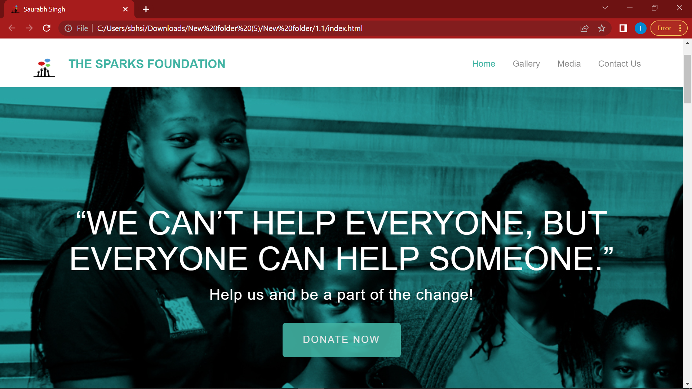
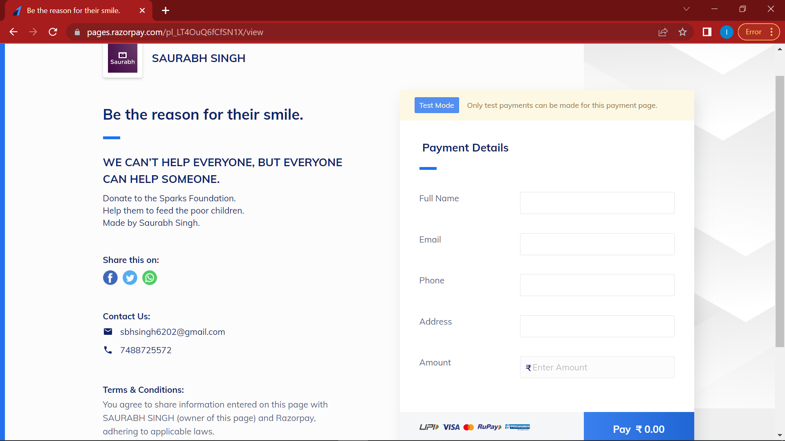
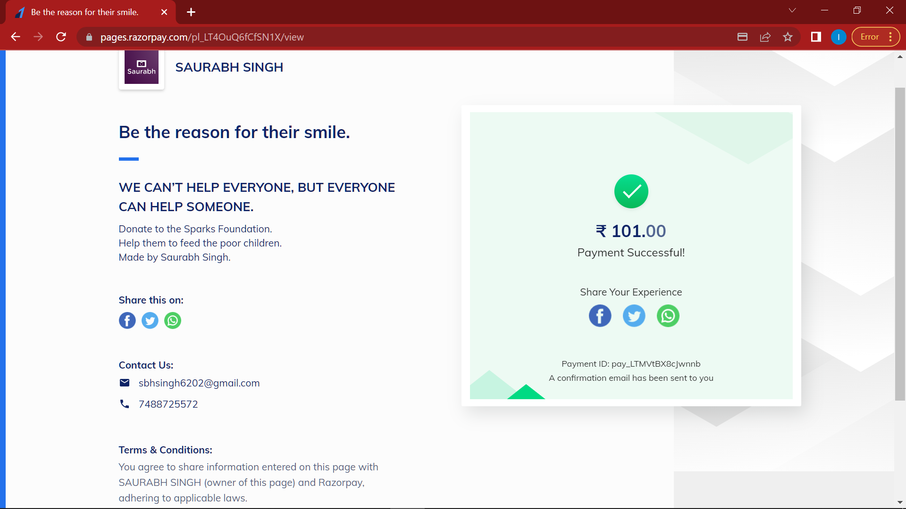
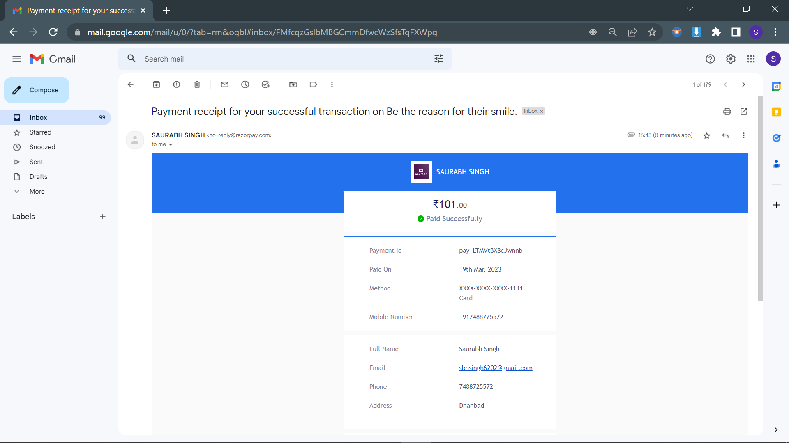

# Made by : Saurabh Singh

<h1>The Sparks Foundation Task</h1>

> Payment Gateway Integration with Donate Button  
> Website - (https://tsftask3saurabh.netlify.app/)

<h2>Table of Contents</h2>

* Homepage
* Donate
* Payment Gateway Interface
* Payment Successful / Payment Failure
* Recipt in email 

<h2>Task 3 : The Sparks Foundation</h2>

> Created a simple website where payment gateway is integrated. There is a simple donate button on homepage, on clicking the donate button, the user will land on the payment page where user can select the amount to be paid and the payment type that includes Credit Card, Netbanking, Paypal and Debit Card. On successful payment an invoice will be generated on a new page regarding completion of the payment.

<h2>Images</h2>

<h2>Description</h2>

> A website that has integrated Razorpay as its payment gateway with only a donate button will have a simple yet powerful design that makes it easy for people to make charitable donations. The website will have a clean and minimalistic design, with a prominent "Donate Now" button placed prominently on the homepage. Clicking on the button will take user to a dedicated donation page, where they can choose the amount they wish to donate.
> On the donation page, users will be ask to enter the custom amount of their choosing. They will also be asked to provide their name, email address, and payment details. When users click the "Donate Now" button, they will be taken to Razorpay's secure payment gateway, where they can select their preferred payment method, such as credit/debit cards, net banking, UPI, or wallets. Once they have entered all the required payment details, they can complete the transaction by clicking on the "Pay Now" button. After the transaction is complete, users will receive a confirmation email from Razorpay with the details of their donation. The website owner will also receive a notification of the donation and will be able to track all donations made through their website.

<h2>Tech Stack used</h2>

* HTML5
* CSS3
* Javascript
* Material Design Bootstrap
